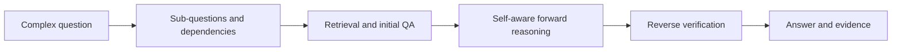

# Bi-CoT

**Forward reasoning and reverse verification for explainable multi-hop question answering.**

Bi-CoT studies how a question-answering system can expose its intermediate questions, answers, and evidence, then revisit the reasoning path before returning a final answer. It combines dependency-aware question decomposition, retrieval and QA, self-aware forward reasoning, and reverse verification without training an additional model.

This repository contains **six recovered research notebooks and a runnable offline answer evaluator**. The notebooks preserve the author's actual experimental code. They are an archival workflow with alternative cells and external dependencies; the complete paper experiment is not packaged as a one-command reproduction.


## Research

**Jiheon Kang and Suhwan Jeong (강지헌, 정수환).** *Plug-and-Play Bi-CoT: Self-Aware Forward Reasoning and Reverse Verification for Explainable Multi-Hop QA.* 2025. The author's CV lists the work at the 6th Korea AI Conference; the local paper draft supplies the expanded title and method description.



The paper draft reports the following HotpotQA Full Wiki results:

| Configuration | Answer EM (%) | Answer F1 (%) |
| --- | ---: | ---: |
| Retrieval + QA baseline | 24.16 | 33.15 |
| Baseline + self-aware QA | 32.67 | 42.62 |
| Full Bi-CoT | 42.77 | 55.40 |

These are **historical results reported in the supplied draft**, not measurements reproduced during this release. The available snapshot does not establish the exact evaluation IDs, every final prompt, or a locked environment. See [research notes](docs/RESEARCH.md) for scope and interpretation.

## Run the offline evaluator

Python 3.10 or newer is sufficient; no model, API key, network access, or extra package is required.

```bash
python tools/evaluate_predictions.py \
  --gold examples/gold.json \
  --predictions examples/predictions.json
```

The included **synthetic** example returns 50.0 EM and approximately 83.33 F1. It demonstrates the evaluator only and is unrelated to the paper's experiment. The evaluator extracts the original notebook's normalization and token-overlap functions, evaluates all supplied gold IDs, and reports missing predictions separately. It does not calculate supporting-fact or joint HotpotQA scores.

## Explore the research notebooks

| Notebook | Actual code covered |
| --- | --- |
| [`MDR_own.ipynb`](notebooks/MDR_own.ipynb) | Dependency-aware decomposition, MDR subprocess integration, UnifiedQA and memory-management experiments |
| [`subQ_preparing.ipynb`](notebooks/subQ_preparing.ipynb) | Dependency-code inspection and intermediate question preparation |
| [`CoT1.ipynb`](notebooks/CoT1.ipynb) | Initial QA, answer aggregation, sentence evidence checks, and question reformulation |
| [`context_beready.ipynb`](notebooks/context_beready.ipynb) | Retrieved-context merging and answer support verification |
| [`CoT1 copy.ipynb`](notebooks/CoT1%20copy.ipynb) | Candidate/evidence aggregation and answerability experiments |
| [`MDR2DATA.ipynb`](notebooks/MDR2DATA.ipynb) | Prediction extraction, intermediate result analysis, and EM/F1 evaluation |

For notebook inspection and adaptation:

```bash
python3 -m venv .venv
source .venv/bin/activate
python -m pip install -r requirements.txt
jupyter lab notebooks
```

`requirements.txt` is an import-derived starting environment, not the missing historical lockfile. MDR uses a separate legacy environment. Follow the [workflow and setup notes](docs/WORKFLOW.md) to acquire the external data/models, configure your own workspace, and select the appropriate notebook cells. API-using cells read `OPENAI_API_KEY` from the environment.

## Release contents and attribution

The source notebooks came from the author's `AI_Study` research archive. Notebook outputs, API credential literals, machine-specific paths, execution counts, and host metadata were removed from the release copies. Historical Colab installation/mount cells and a standalone cleanup cell were converted to markdown. Original source files were left untouched.

Third-party projects and weights are acquired from their authors, including [MDR](https://github.com/facebookresearch/multihop_dense_retrieval), [HotpotQA](https://hotpotqa.github.io/), and [UnifiedQA](https://huggingface.co/allenai/unifiedqa-t5-large). Their licenses and acknowledgements remain applicable. This release does not relicense third-party material, datasets, or the coauthored paper. No repository-wide software license was present in the recovered author snapshot; no new license is asserted here.

See [provenance](docs/PROVENANCE.md), [research notes](docs/RESEARCH.md), and [CITATION.cff](CITATION.cff).
